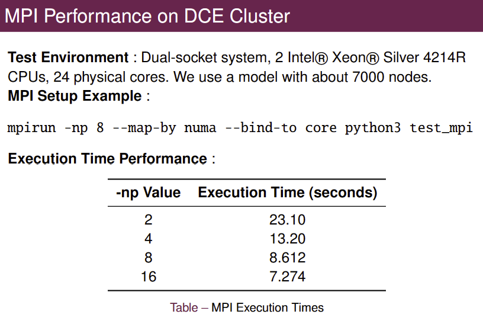
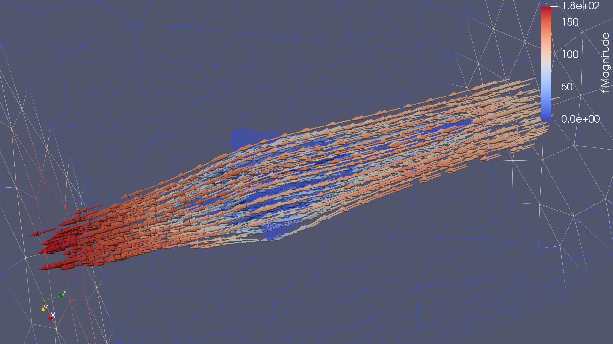
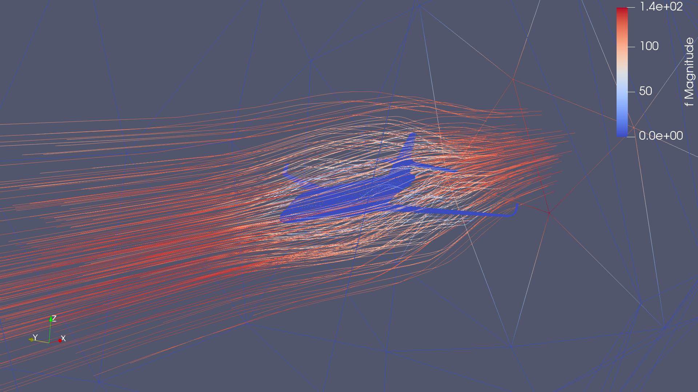

# High Performance Computing for Footprint Reduction in Aeronautics

## Overview
This project focuses on reducing the environmental impact of air transport by optimizing the aerodynamic properties of aircraft using high-performance computing. With the increasing number of flights annually, aircraft are a significant source of CO2 emissions, contributing 2.5% of global emissions by 2019. This project aims to improve aircraft fuel consumption through advanced computational fluid dynamics (CFD) simulations.

## Learning Objectives
In this project, you will learn how to:
- Set up a fluid flow simulation.
- Discretize airfoil shapes for numerical simulations.
- Determine drag and lift around different shapes.
- Set up a finite element simulation for flow around an airplane.
- Use modern high-performance computing algorithms to optimize shapes for the best lift-to-drag ratios.

## Tools and Technologies
We utilize the following open-source software tools:
- **Finite Element Software:** FEniCSx (Python)
- **Meshing Tools:** Gmsh, MeshMixer
- **Visualization:** VTK (Paraview)

## Project Highlights
### Computational Fluid Dynamics Simulation
Our simulations involve setting up 3D and 2D meshes of aircraft such as the Concorde and Falcon, analyzing drag and lift under various conditions, and using a high-performance computing cluster with over 50 cores utilizing MPI.

### Numerical Simulation
Numerical simulations allow us to determine the drag and lift for various shapes efficiently, guided by modern optimization algorithms to find the best shapes.

## Results
We conducted detailed simulations of the Concorde with and without the broken nose, as well as the Falcon. The results include:
- 3D and 2D mesh analysis of aircraft.
- Drag and lift analysis across various angles.
- Performance of the code parallelization using MPI.
- High-resolution images showing drag and lift relationships under different scenarios.




## Key Findings
- **Drag Reduction in Concorde:** It was anticipated that the Concorde in normal operation would have lower drag, but the broken nose design proved to be highly efficient during take-off, a critical phase for fuel consumption.
- **Mesh Quality Issues:** Initial STL meshes were not suitable for numerical simulations due to elongated elements and non-closing surfaces. Using Rhinoceros 8’s ShrinkWrap and QuadRemesh functionalities, we generated dense, optimized meshes.
- **Boundary Conditions and Weak Formulation:** Essential for defining fluid behavior at domain limits, ensuring physical and mathematical correctness of solutions to the 3D Stokes equations.

## Visualization
Streamline visualization using ParaView provides an intuitive way to analyze fluid flow patterns around complex geometries such as aircraft surfaces.

1. **Wireframe Representation:** Enables a clear view of internal flow paths.
2. **Stream Tracer Application:** Initializes streamlines from specified seed locations within the flow field.
3. **Tube Filter Enhancement:** Enhances visibility of streamlines.




## Test Environment
- **Hardware:** Dual-socket system with 2 Intel® Xeon® Silver 4214R CPUs, 24 physical cores.
- **Mesh:** Model with approximately 7000 nodes.
- **MPI Setup Example:**
  ```sh
  mpirun -np 8 --map-by numa --bind-to core python3 test_mpi